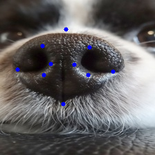

# Landmark detection by ResNet
<table>
  <tr>
    <td></td>
    <td></td>
  </tr>
</table>

## The project contains:
1. Training for landmark detection in dog nose using ResNet
2. Inference with the trained model.


# Training
Before training, you need to prepare a dataset in .npy file.\
The .npy file should be dictionary type with two keys; 'img', which have values in form of (number of data, 224, 224, 3) and 'landmark', which have values in form of (number of data, 2 * number of landmark).\
This is an example.

```python
{
  'img': 
    [
      array([[[159, 196,  74],
        [159, 196,  74],
        [159, 196,  74],
        ...,
        [159, 196,  74],
        [159, 196,  74],
        [159, 196,  74]],

       [[159, 196,  74],
        [159, 196,  74],
        [159, 196,  74],
        ...,
        [159, 196,  74],
        [159, 196,  74],
        [159, 196,  74]],

       [[159, 196,  72],
        [159, 196,  72],
        [159, 196,  72],
        ...,
        [159, 196,  72],
        [160, 195,  74],
        [160, 195,  74]],

       ...,

       [[160, 195,  74],
        [160, 195,  74],
        [160, 196,  72],
        ...,
        [159, 196,  72],
        [159, 196,  72],
        [159, 196,  72]],

       [[162, 195,  74],
        [162, 195,  74],
        [160, 196,  72],
        ...,
        [159, 196,  72],
        [159, 196,  72],
        [159, 196,  72]],

       [[162, 195,  74],
        [162, 195,  74],
        [160, 196,  72],
        ...,
        [159, 196,  72],
        [159, 196,  72],
        [159, 196,  72]]], dtype=uint8), 
      array([[[ 48, 103,  54],
        [ 48, 103,  54],
        [ 52, 101,  57],
        ...,
        [ 52, 101,  57],
        [ 52, 101,  57],
        [ 52, 101,  57]],

       [[ 48, 103,  54],
        [ 50, 102,  54],
        [ 52, 101,  57],
        ...,
        [ 52, 101,  57],
        [ 52, 101,  57],
        [ 52, 101,  57]],

       [[ 50, 102,  54],
        [ 50, 102,  54],
        [ 52, 101,  57],
        ...,
        [ 52, 101,  57],
        [ 52, 101,  57],
        [ 52, 101,  57]],

       ...,

       [[ 52, 101,  57],
        [ 52, 101,  57],
        [ 52, 101,  57],
        ...,
        [ 52, 102,  54],
        [ 52,  99,  60],
        [ 52,  99,  61]],

       [[ 52, 101,  57],
        [ 52, 101,  57],
        [ 52, 101,  57],
        ...,
        [ 52, 102,  54],
        [ 52,  99,  60],
        [ 52,  99,  61]],

       [[ 52, 101,  57],
        [ 52, 101,  57],
        [ 52, 101,  57],
        ...,
        [ 52, 102,  54],
        [ 52,  99,  60],
        [ 52,  99,  61]]], dtype=uint8)
    ], 
  'landmark': 
    [
      array([119, 100, 138, 148, 109, 117, 121, 127, 118, 137, 96, 138, 143, 106, 138, 121, 148, 125, 154, 116], dtype=object), 
      array([118, 101, 138, 149, 108, 116, 123, 127, 119, 139, 95, 136, 142, 108, 134, 117, 142, 125, 152, 115], dtype=object)
    ]
}
```

After your dataset is ready, load the dataset and decide the architecture of the ResNet model.\
There are two types of architecture; resnet50 and resnet101.\
While training, the weights of keras model will be saved in models directory.\
The training will terminates after executing all epochs you set, or it ends if the validation loss doesn't get smaller after 20 epochs. 

```python
from noseprint import Train

noseprint = Train(dataset='dataset path', architecture='resnet101')
noseprint.train(epochs=100, model_dir='./models')
```

# Inferencing
After you finish the training, you can check the performance of your model.\
The funcion "get_landmarks()" will return the coordinates of each landmarks.


```python
from noseprint import Inference

noseprint = Inference(weights='weights path', architecture='resnet101', num_landmarks=10)
landmarks = noseprint.get_landmarks(image='image path')
```

<table>
  <tr>
    <td></td>
    <td></td>
  </tr>
</table>
